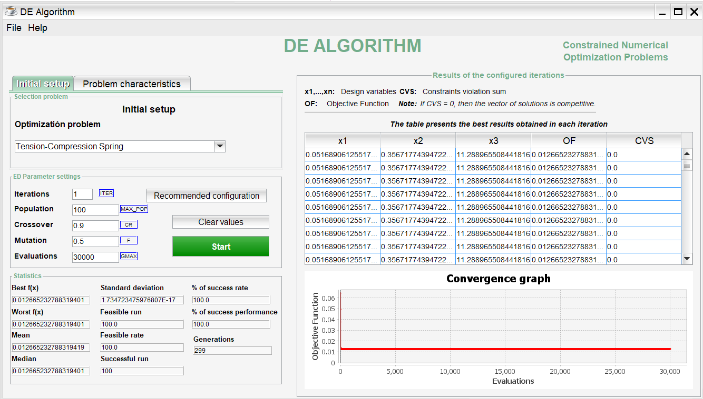

# jED
This software is a graphical user interface that uses the differential evolution algorithm to solve constrained numerical optimization problems. In its current version, it contains only five preloaded problems with adjustments for defects in their parameters that allow the algorithm to provide competitive solutions. Parameter values can be changed by the user for each problem.

