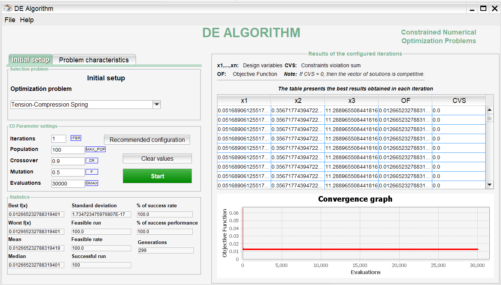

# DifferentialEvolution
An easy-to-use graphical user interface for calibration of the parameters of the Differential Evolution algorithm implemented in Java, and used to solve constrained numerical optimization problems.

